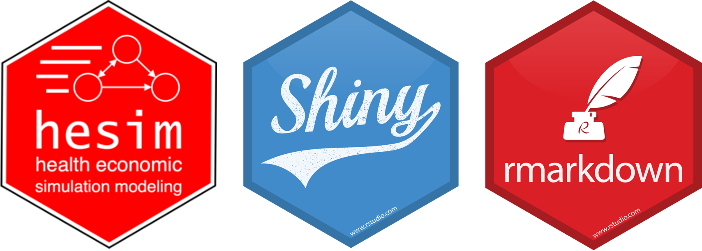
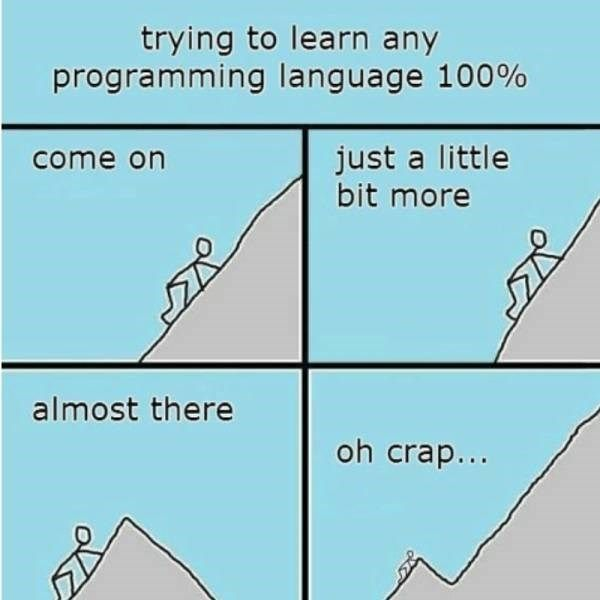
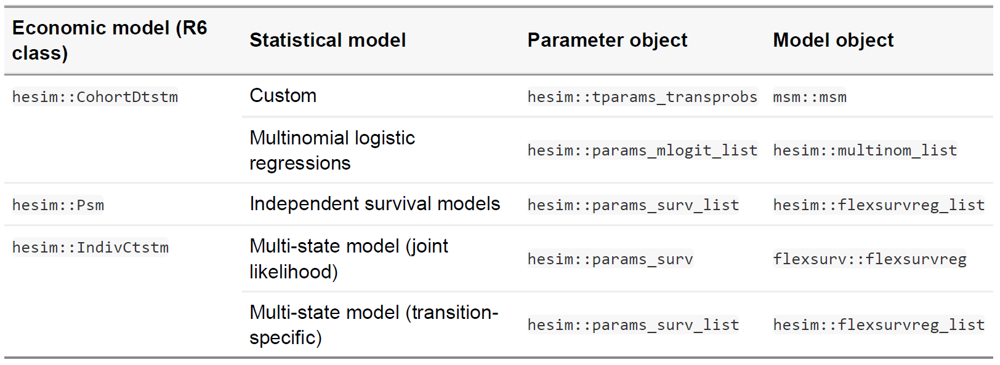
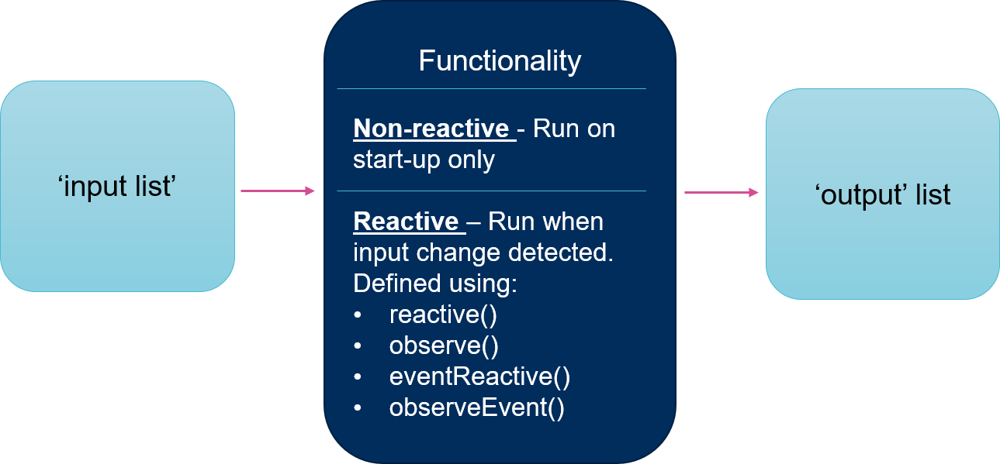
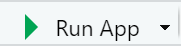

```{r setup, include=FALSE}
options(htmltools.dir.version = FALSE)
```

### <br> An overview of additional useful packages for health economic modelling

`hesim` - an R package for implementing and analysing health economic simulation models
<br><br>


`rmarkdown` - a file format for making documents with R
<br><br>


`shiny` - a package that makes it possible to create interactive web applications from R code
<br><br>


<center></center>

---
### <br> Session objectives

By the end of this session you should:


1) Be aware of additional useful packages in R that can be useful for building models, documenting them, and distributing them to a technical or non-technical audience
<br>


2) Know how to set up a default shiny app and rmarkdown script, and know locations of examples for further learning
<br>


3) Have considered learning pathways and objectives specific to your work requirements
<br>


<center></center>

---
## <br>Group discussion

--

In groups of two or three (those seated around you), please discuss the following questions and come up with at least 1 point for each:
<br><br>


1) What do you most want to learn how to do in R?

2) What are the key barriers to you developing and using R for what you need?

<br><br>

--


<br><br>
<b>You have 5 minutes</b>


---
## <br>The hesim package

`hesim` supports three types of health economic models:

(i) **Cohort discrete time state transition models (cDTSTMs)** - These are Markov cohort models and can be time-homogeneous or time-inhomogeneous

(ii) **N-state partitioned survival models (PSMs)** - Area under the curve model

(iii) **Individual-level continuous time state transition models (iCTSTMs)** - individual-level simulations that can encompass both Markov and semi-Markov processes


All models are implemented as R6 classes and have methods for simulating disease progression, QALYs, and costs.

This package is well documented in its [CRAN vignette](https://cran.r-project.org/web/packages/hesim/vignettes/intro.html) and [publication](https://www.researchgate.net/publication/349424271_hesim_Health_Economic_Simulation_Modeling_and_Decision_Analysis/link/605c068192851cd8ce65e830/download)

CRAN vignette: https://cran.r-project.org/web/packages/hesim/vignettes/intro.html <br>
Publication: https://www.researchgate.net/publication/349424271

--


One of the examples is recreated in the [short course GitHub repo](https://github.com/rhart1/Health-Economic-Modeling-in-R_A-Hands-on-Introduction-/blob/main/Additional%20useful%20packages/hesim%20example%20model.R) (*hesim example model.R* script in the *Additional useful packages* folder)


---
### <br>hesim functionalities
<center></center>

---
### <br>You've made a model. What's next?

--

You will now need to communicate it to a wider audience.

--

Therefore, you will need to consider the following points for your project:

--

- Who is your audience?

 - Do they know R?
 

- What outputs do you need to effectively communicate this model, and make it as transparent as possible?

  - Graphs
  - Tables
  - Intermediate calculations
  

- What documentation is required?


---
## <br>R Markdown
`rmarkdown` - a file format for making documents with R
<br><br> 
There are two examples of this in [short course GitHub repo](https://github.com/rhart1/Health-Economic-Modeling-in-R_A-Hands-on-Introduction-/tree/main/Additional%20useful%20packages/R%20Markdown%20scripts), one in html and one in pdf.

Please open the *Additional useful packages* folder and open the *R Markdown scripts* folder. There are two scripts there.

- Looking through, there are differences between a standard R script and an rmd script

  - It is text (white background) interspaced by code 'chunks' (grey background)
  - This means that you do not need to copy and paste R outputs to your report, you only need to write the report and interpret
  
--

- There is really good documentation on how you can create one

  - https://bookdown.org/yihui/rmarkdown - Online book
  - https://rmarkdown.rstudio.com/gallery.html - Examples
  
--

<br><br>
A default R Markdown document can be created from within RStudio (5 minute example exercise)

---
## <br>R Markdown
The examples in this project are called from the *hesim example model.R* script

```{r eval=FALSE, tidy=FALSE}
library(rmarkdown)   # For creating markdown outputs (html and pdf)
library(bookdown)    # For creating markdown outputs (html and pdf)
library(knitr)       # For creating markdown outputs (html and pdf)
library(kableExtra)  # For creating nice-looking tables in rmarkdown

Export_params <- list(
  # Main results
  Stateprobs            = ictstm$stateprobs_,
  Summarisedf           = ce_sim_ictstm,
  labs_indiv            = labs_indiv
)

Markdown_location <- "./Additional useful packages/R Markdown scripts/"
```

---
## <br>R Markdown

```{r eval=FALSE, tidy=FALSE}
# html document
rmarkdown::render(
  input = file.path(Markdown_location,"hesim html report.Rmd"),
  output_format = 'bookdown::html_document2',
  output_file = "./Additional useful packages/hesim-html-report.html",
  params = Export_params,
  envir = environment()
)

# pdf document
rmarkdown::render(
  input = file.path(Markdown_location,"hesim pdf report.Rmd"),
  output_format = 'bookdown::pdf_document2',
  output_file = "./Additional useful packages/hesim-pdf-report.pdf", 
  params = Export_params,
  envir = environment()
)
```

If you are unable to generate these documents at present, the generated html and pdf documents are in the *Additional useful packages* folder at the top level.

---
## <br>Shiny
`shiny` - a package that makes it possible to create interactive web applications from R code

Creating an R shiny app considerably increases the accessibility of your R code. However, it is a further learning curve and can be time consuming. 

At it's most basic, a shiny app usually consists of three scripts:
- app.R 
  - The application is called from this script
- server.R
  - The app functionality. This is wrapped within a function: `function(input, output, session){}` 
  - This contains the code for the app 'back-end'
- ui.R
  - This is the layout of the graphical user interface (GUI)
  - This contains the code for the app 'front-end'

<br><br>  
However, it is possible to have the server function and ui within the app.R script; this is the case in the default app if created from RStudio (5 minute example exercise)


---
### <br>Shiny reactivity

Having your R code as a shiny app enables users to interact with the R code without seeing the R code. This works by the app 'front-end' changes causing reactions in the 'back-end' calculations.

--

1. The user interacts with the input boxes defined in the `ui.R` script <br><br>

--

2. The functions which are reactive to front-end changes are wrapped in reactive functions (e.g. reactive(), observe()) in `server.R` <br><br>

--

3. The reactive functions are always 'listening' for changes - when they detect a change the function will re-run <br><br>

--

4. The re-running of the reactive functions causes a change in the output, which the user can then see <br><br>

--

An object that is reactive (created using reactive()) is a function. This means that when referring to it later in the script, the syntax changes and brackets are needed (e.g. ictstm in the standard script becomes ictstm() in the server.R script)

---
### <br>Defining shiny inputs and outputs

There are two major lists that enable communication between the front-end and back-end:

**input list**
  - These are mostly defined in the UI
  - There are many different types, depending on the type of input
  - Each has an id, which can then be used within functions to reference the input value. For example, a numeric input with an id = 'number' can be referenced in a function but using `input$number`
  - Examples of inputs can be found here: https://shiny.rstudio.com/tutorial/written-tutorial/lesson3/

```{r eval=FALSE, tidy=FALSE} 
#Input example:
#This is written in the ui
numericInputIcon(
  inputId = "Input_discount_Costs",
  label = "Discount for Costs:",
  min = 0,
  max = 100,
  value = 3.5,
  icon = list(NULL, icon("percent"))
)
```

---
### <br>Defining shiny inputs and outputs

**output list**
  - The results of your functions that you want to then display front-end are defined in the outputs list
  - As with inputs, there are a variety of functions that can be used depending on the type of output you want to display
  - Each has an id. The location of the output is defined in the ui, and then the output content is defined in the server

```{r eval=FALSE, tidy=FALSE} 
#Output example:
#This is written in the ui
plotOutput("Results_graph")

#This is written in the server
output$Results_graph <- renderPlot({
    autoplot(ictstm()$stateprobs_, labels = labs_indiv,
             ci = FALSE) + theme_bw()
  })
```
  

---
### <br>Summary of shiny

<center></center>

---
### <br>app.R

Please open the *hesim shiny app* folder within the *Additional useful packages* folder. Open the *app.R* script.

If you have all the packages previously installed, you should be able to run the app either by clicking the 'Run App' button in the top right hand corner,  or by highlighting all the text and pressing **Ctrl + Enter**

--

<br><br>
Familiarize yourself with the layout of the app. All the functionality and graphs in the *hesim example model* are presented here
<br><br>

---
### <br>Shiny app learning and further examples

There are some great tutorials for learning how to create shiny apps:


1. https://mastering-shiny.org/basic-app.html

2. https://shiny.rstudio.com/tutorial/

--

<br><br>

There are also some great examples of shiny apps that others have created:

  
1. R Studio gallery - https://shiny.rstudio.com/gallery/

2. BCEA web application - https://gianluca--gianlucabaio.netlify.app/software/bceaweb/

3. HTA model proof-of-concept - https://bresmed-intrface-hypothetical-car-t-model.shinyapps.io/IntRface_Model-PharmacoEconomics/


<br><br>


---
## <br>Making shiny apps accessible

Shiny apps can be made available and deployed in a variety of ways, for example:

--

1. R Studio (or equivalent)

  - Local or online environment to view code and run app

--

2. shinyapps.io - https://www.shinyapps.io/
 
  - Online environment to deploy app publicly (free) or make available with log-in (paid), hosted on R Studio servers

--

3. R Studio Connect - https://www.rstudio.com/products/connect/

  - Hosting environment software to download on privately owned server (paid subscription)


<br><br>

---
### <br> Session objectives (re-visited)

By the end of this session you should:

--

1) Be aware of additional useful packages in R that can be useful for building models, documenting them, and distributing them to a technical or non-technical audience
<br>


2) Know how to set up a default shiny app and rmarkdown script, and know locations of examples for further learning
<br>


3) Have considered learning pathways and objectives specific to your work requirements
<br>


<center></center>


---
class:center

## <br><br>Thank you for joining this <br>ISPOR 2022 Short Course, Vienna 

### <br>Felicity Lamrock, PhD; Howard Thom, PhD; Gianluca Baio, PhD; Rose Hart, PhD

