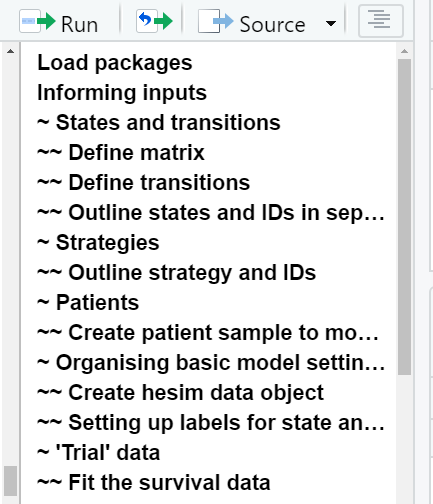
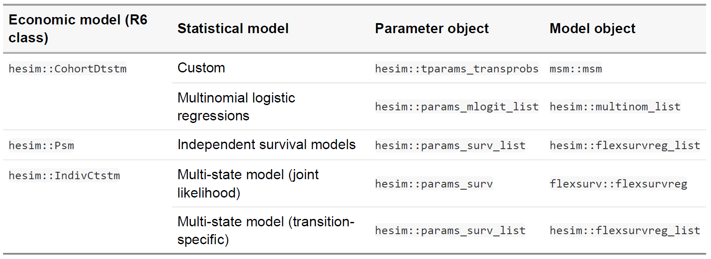
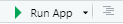
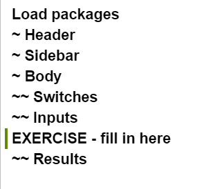
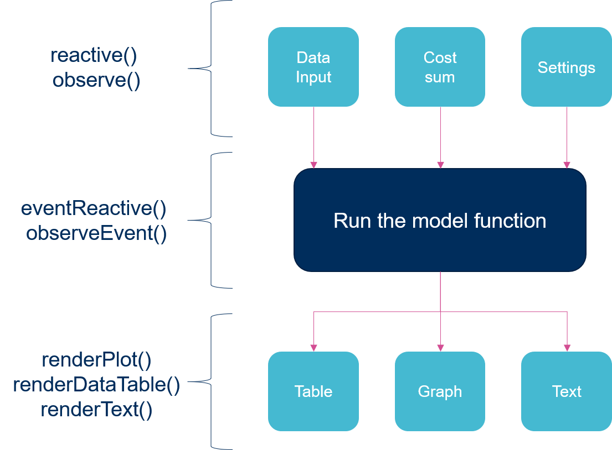
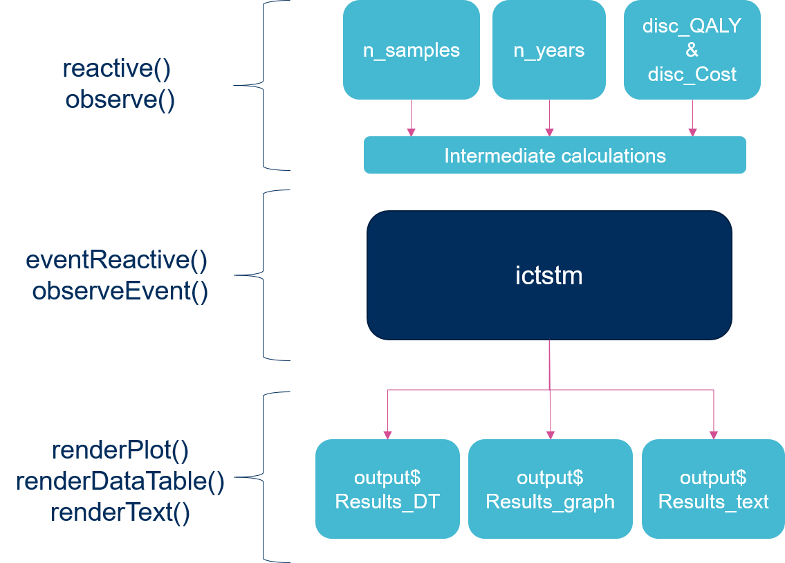

```{r setup, include=FALSE}
options(htmltools.dir.version = FALSE)
```

## <br>Overview

`hesim` - an R package for implement and analyzing health-economic simulation models
<br><br>

--

`rmarkdown` - a file format for making documents with R
<br><br>

--

`shiny` - a package that makes it possible to create interactive web applications from R code
<br><br>


--

<center></center>

---

## <br>The hesim package

`hesim` supports three types of health economic models:

(i) **Cohort discrete time state transition models (cDTSTMs)** -  Markov cohort models and can be time-homogeneous or time-inhomogeneous

(ii) **N-state partitioned survival models (PSMs)** - Area under the curve model

(iii) **Individual-level continuous time state transition models (iCTSTMs)** - individual-level simulations that can encompass both Markov and semi-Markov processes


All models are implemented as R6 classes and have methods for simulating disease progression, QALYs, and costs.

This package is well documented in its [CRAN vignette](https://cran.r-project.org/web/packages/hesim/vignettes/intro.html) and [publication](https://www.researchgate.net/publication/349424271_hesim_Health_Economic_Simulation_Modeling_and_Decision_Analysis/link/605c068192851cd8ce65e830/download)

CRAN vignette: https://cran.r-project.org/web/packages/hesim/vignettes/intro.html <br>
Publication: https://www.researchgate.net/publication/349424271

---
## <br>How this session will work

If you have not done this already, please open your downloaded materials for this short course as a **project**
- Instructions how to do this are in the pre-reads


Please open the *Advanced functionality of R* folder and open the *hesim example model.R* script

--

There are three parts of this session: <br><br>
--
1. The *hesim example model.R* script contains an example model code - this is heavily based on the example in the [CRAN vignette](https://cran.r-project.org/web/packages/hesim/vignettes/intro.html) https://cran.r-project.org/web/packages/hesim/vignettes/intro.html - we will go through this line by line <br><br>
--
2. Output the results of the model into RMarkdown PDF and HTML report examples <br><br>
--
3. Demonstrates the model as a `shiny` application <br><br>

---
## <br>hesim example model

```{r eval=TRUE, tidy=TRUE, message = FALSE}
# Load packages ---------------
# These will need installing if they have not been used before
# install.packages("hesim")
# install.packages("data.table")
# install.packages("flexsurv")
# install.packages("survminer")
# install.packages("heemod")
# install.packages("magrittr")
library("hesim")      # Containing the mock trial data and the functions formodel construction
library("data.table") # Used for organising the data in this example
library("flexsurv")   # used for fitting parametric models to the trial data
library("survminer")  # useful for easily presenting Kaplan–Meier plots. It also loads `ggplot2` as a dependent, which is a versatile package for producing 
                      # almost any type of graph
library("heemod")     # Can produce a really simple model diagram - also has other useful 
                      # functions for partitioned survival modelling
library("magrittr")   # Structuring data sequences with left -> right formatting instead of nested functions

```
```{r echo=FALSE, tidy=FALSE, message = FALSE}
# I don't want to print this bit to the slides as it is not in the hesim script
# install.packages("kableExtra")
library(kableExtra)
```


Tip: for commenting / uncommenting lines, highlight the lines and type **ctrl + shift + c**

---

## <br>Informing the inputs

First thing in an R model is always to consider how the inputs are entered and presented (with comments), and how they are to be used.

The inputs included in this model are similar to most models:
- States and transitions
- Strategies
- Patient characteristics
- Trial data and fits
- Costs
- Utilities

Click the document outline toggle in the top right corner of console to see inputs layout

---
## <br>Informing the inputs

<center></center>

---

## <br>Inputs
```{r eval=TRUE, tidy=FALSE}
# Informing inputs --------------
# ~ States and transitions ---------
# ~~ Define matrix ---------------
tmat <- rbind(
 c(NA, 1, 2),
 c(NA, NA, 3),
 c(NA, NA, NA)
 )
colnames(tmat) <- rownames(tmat) <- c("Stable", "Progression", "Death")
print(tmat)
```

---
## <br>Define states and transitions
```{r eval=TRUE, tidy=FALSE}
# ~~ Define transitions ---------------
transitions <- create_trans_dt(tmat)
print(transitions)

Model_Diagram <- define_transition( #this function is part of the heemod package
  state_names = c("Stable", "Progression", "Death"),
  Stable,transition_id_1, transition_id_2,
  ,Progressed, transition_id_3,
  , , Death
)
  
```

---
### <br>Creating simple model diagram
```{r eval=TRUE, tidy=FALSE, out.width='\\textwidth', fig.height = 7, fig.align='center'}

plot(Model_Diagram)
```

---
## <br>Define states and transitions (cont.)

```{r eval=TRUE, tidy=FALSE}
# ~~ Outline states and IDs in separate table for easy referencing --------------
# Death is automatically added by get_labels() (below) in the code below in the default 
# settings, but 'death_label = NULL' argument in get_labels() this will override this.
# Current setup is to maintain simplicity
states <- data.table(
  state_id = 1:2,
  state_name = c("Stable", "Progression")
)
```

---
## <br>Strategies
```{r eval=TRUE, tidy=FALSE}
# ~ Strategies ----------------------
# ~~ Outline strategy and IDs ----------------
strategies <- data.table(
  strategy_id = 1:3,
  strategy_name = c("SOC", "New 1", "New 2")
  )
print(strategies)
```

---
## <br>Patients
```{r eval=TRUE, tidy=FALSE}

n_patients <- 1000
patients <- data.table(
  patient_id = 1:n_patients,
  age = rnorm(n_patients, mean = 45, sd = 7),
  female = rbinom(n_patients, size = 1, prob = .51)
)
# If groups are wanted, these can be defined in the 'grp_id' and 'grp_name' columns.
# Otherwise can be commented and left blank.
# patients[, grp_id := ifelse(female == 1, 1, 2)]
# patients[, grp_name := ifelse(female == 1, "Female", "Male")]

Patient_plot <- ggplot(patients, aes(x = age, fill = as.factor(female))) + 
      geom_histogram(binwidth = 1, colour = "#959595") + 
      theme_bw() + 
      scale_fill_manual("Gender:", values = c("#0D8E1E","#9552BB"),
                        labels = c("Male","Female"))

```

---
### <br>Patient samples
```{r eval=TRUE, tidy=FALSE, out.width='\\textwidth', fig.height = 6, fig.align='center'}

Patient_plot
```

---
## <br>Organising model
```{r eval=TRUE, tidy=FALSE}
#Wrapping the dataframes of the model into the hesim_data() function,

hesim_dat <- hesim_data(
   strategies = strategies,
   patients = patients,
   states = states,
   transitions = transitions
   )

# Not printing this as it will take too much space on the slides
```

---

## <br>Organising model
```{r eval=TRUE, tidy=FALSE}
# ~~ Setting up labels for state and strategy IDs ---------------
labs_indiv <- get_labels(hesim_dat)
print(labs_indiv)
```

---
## <br>Trial data
```{r eval=TRUE, tidy=FALSE}
# ~ 'Trial' data ----------
# hesim package includes the 'onc3' data.table. This separates the three transitions by 'transition_id', where the IDs match the 'transitions' data
# These individual transitions can be filtered for and have parametric models fitted
# Data example showing patients 1 and 2:
onc3[patient_id %in% c(1, 2)]
```

---
### <br>View the trial data
```{r eval=TRUE, tidy=FALSE}
transition_id_view <- 1
TransitionData <-
  survfit(as.formula(Surv(time, status) ~ strategy_name), 
          data = onc3[which(transition_id == transition_id_view),])

trialdata_plot <- ggsurvplot(
  fit      = TransitionData,
  data     = onc3,
  xlab = 'Time (Years)',
  ylab = 'Survival',
  risk.table = TRUE,
  legend = "top"
)
```

---
### <br>View the trial data
```{r eval=TRUE, tidy=FALSE, out.width='\\textwidth', fig.height = 6, fig.align='center'}
trialdata_plot
```

---
### <br>Fit the survival data
```{r eval=TRUE, tidy=FALSE}
n_trans <- max(tmat, na.rm = TRUE)
wei_fits <- vector(length = n_trans, mode = "list")
f <- as.formula(Surv(time, status) ~ factor(strategy_name) + female + age)

for (i in 1:length(wei_fits)){
  if (i == 3) {f <- update(f, .~.-factor(strategy_name))} 
  wei_fits[[i]] <- flexsurvreg(f, data = onc3,
                               subset = (transition_id == i),
                               dist = "weibull")
}

wei_fits <- flexsurvreg_list(wei_fits) 
#This is now a list of three sets of Weibull parameters, one for each transition
```

---
## <br>Drug Costs
```{r echo=FALSE, tidy=FALSE, message = FALSE}
drugcost_dt <- matrix(c(
  1, 1, 1, 0.00, 0.25,  2000,
  1, 1, 2, 0.25, Inf, 2000,
  1, 2, 1, 0.00, 0.25,  1500,
  1, 2, 2, 0.25, Inf , 1200,
  2, 1, 1, 0.00, 0.25,  12000,
  2, 1, 2, 0.25, Inf , 12000,
  2, 2, 1, 0.00, 0.25,  1500,
  2, 2, 2, 0.25, Inf , 1200,
  3, 1, 1, 0.00, 0.25,  15000,
  3, 1, 2, 0.25, Inf , 15000,
  3, 2, 1, 0.00, 0.25,  1500,
  3, 2, 2, 0.25, Inf , 1200
),byrow = TRUE, ncol = 6, dimnames = list(NULL, c("strategy_id", "state_id", "time_id", "time_start", "time_stop","est")))
```

```{r eval=TRUE, tidy=FALSE}
drugcost_dt <- data.table(drugcost_dt)

drugcost_tbl <- stateval_tbl(
  drugcost_dt,
  dist = "fixed")
head(drugcost_tbl)
```

---
## <br>Other Costs
```{r eval=TRUE, tidy=FALSE}
# ~~ Medical costs ---------------
medcost_tbl <- stateval_tbl(
  data.table(state_id = states$state_id,
             mean = c(2000, 9500),
             se = c(2000, 9500)
  ),
  dist = "gamma")
#print(medcost_tbl)

# ~ Utilities ----------------
utility_tbl <- stateval_tbl(
  data.table(state_id = states$state_id,
             mean = c(.8, .6),
             se = c(0.02, .05)
             ),
  dist = "beta")
#print(utility_tbl)
```

---
## <br>Setting up the model
```{r eval=TRUE, tidy=FALSE}
# Setting up the model --------------
# ~ Number of parameter samples is needed to use for the PSA
n_samples <- 100

# ~ Expanding the data input dataframe to set up for running all patients with all strategies
transmod_data <- expand(hesim_dat,
                        by = c("strategies", "patients"))
head(transmod_data)
```

---
## <br>Setting up the model
```{r eval=TRUE, tidy=FALSE}
# ~ Wrapping inputs in hesim functions for use in model -------------
# ~~ Efficacy -----------------
transmod <- create_IndivCtstmTrans(wei_fits, transmod_data,
                                   trans_mat = tmat, n = n_samples,
                                   uncertainty = "normal",
                                   clock = "reset",
                                   start_age = patients$age)
```

---
## <br>Setting up the model
```{r eval=TRUE, tidy=FALSE}
# ~ Wrapping inputs in hesim functions for use in model -------------
# ~~ Efficacy -----------------
# ~~ Utilities -----------------
utilitymod <- create_StateVals(utility_tbl, n = n_samples,
                               hesim_data = hesim_dat)

# ~~ Costs ------------------
drugcostmod <- create_StateVals(drugcost_tbl, n = n_samples,
                                time_reset = TRUE, hesim_data = hesim_dat)
medcostmod <- create_StateVals(medcost_tbl, n = n_samples,
                                 hesim_data = hesim_dat)
costmods <- list(Drug = drugcostmod,
                   Medical = medcostmod)
```


---
## <br>Setting up the model
```{r eval=TRUE, tidy=FALSE}
# ~ Combining input into economic model -------------------
ictstm <- IndivCtstm$new(trans_model = transmod,
                         utility_model = utilitymod,
                         cost_models = costmods)
```

---
## <br>Run the model 
```{r eval=TRUE, tidy=FALSE}
# Run the disease simulation ----------------
# ~ Run simulation -------------
# This runs the disease simulation, and assumed that the max patient age is 100 (after which they automatically transfer to 'Death' state)
ictstm$sim_disease(max_age = 100, progress = FALSE)
# This is the event data simulated for each patient
head(ictstm$disprog_)
```

---
## <br>Generate the results 
```{r eval=TRUE, tidy=FALSE}
# ~ Generate outcomes --------------
# ~~ Survival --------------
# Create survival curves with set time intervals
# Time is in years, so this will measure from 0 to 30 years, with 1/12 (1 month) intervals 
ictstm$sim_stateprobs(t = seq(0, 30 , 1/12))
head(ictstm$stateprobs_)

Results_plot <- autoplot(ictstm$stateprobs_, labels = labs_indiv,
            ci = FALSE) + theme_bw()
```

---
## <br>Generate the results: Survival
```{r eval=TRUE, tidy=FALSE, fig.height = (12 / 2.1),fig.width = (18 / 1.25)}
Results_plot 
```

---
## <br>Generate the results: QALYs
```{r eval=TRUE, tidy=FALSE}
# ~~ QALYS -------------
# QALYs and costs are simulated separately from the simulation of the disease
ictstm$sim_qalys(dr = c(0,.03))
head(ictstm$qalys_)
```

---
## <br>Generate the results: Costs
```{r eval=TRUE, tidy=FALSE}
# ~~ Costs ------------ 
ictstm$sim_costs(dr = c(0,.01))
head(ictstm$costs_)
```

---
## <br>Generate the results: Summary
```{r eval=TRUE, tidy=FALSE}
# ~ Summarize ----------------
ce_sim_ictstm <- ictstm$summarize()

Tableout <- summary(ce_sim_ictstm, labels = labs_indiv) %>% format()

kbl(Tableout, booktabs = T, position = "h", align = "c", centering = T, caption = "Summary of total costs and QALYs")
```


---
### <br>Other hesim functionalities
<center></center>

---
### <br>Starting your own models
Where do you start?
<br><br>
--

- Break model down into manageable chunks
- Use existing examples to guide you

<br><br>
--

What is in this model? 
<br><br>
--

- It is just dataframes, a few graphs and some pre-made functions put together by following freely available documentation

---
### <br>You've made your model... now what?

--

You will now need to communicate it to a wider audience.

--

Therefore, you will need to consider the following points for your project:

--

- Who is your audience?

 - Do they know R?
 
--

- What outputs do you need to effectively communicate this model, and make it as transparent as possible?

  - Graphs
  - Tables
  - Intermediate calculations
  
--

- What documentation is required?


---
## <br>R Markdown
`rmarkdown` - a file format for making documents with R
<br><br> 
There are two examples of this, one in html and one in pfd

Please open the *Advanced functionality of R* folder and open the *R Markdown scripts* folder. There are two scripts there.

- Looking through, there are differences between a standard R script and an rmd script

  - It is text (white background) interspaced by code 'chunks' (grey background)
  - This means that you do not need to copy and paste R outputs to your report, you only need to write the report and interpret
  
--

- There is really good documentation on how you can create one

  - https://bookdown.org/yihui/rmarkdown - Online book
  - https://rmarkdown.rstudio.com/gallery.html - Examples
  
---
## <br>R Markdown
The examples in this project are called from the *hesim example model.R* script

```{r eval=FALSE, tidy=FALSE}
library(rmarkdown)   # For creating markdown outputs (html and pdf)
library(bookdown)    # For creating markdown outputs (html and pdf)
library(knitr)       # For creating markdown outputs (html and pdf)
library(kableExtra)  # For creating nice-looking tables in rmarkdown

Export_params <- list(
  # Main results
  Stateprobs            = ictstm$stateprobs_,
  Summarisedf           = ce_sim_ictstm,
  labs_indiv            = labs_indiv
)

Markdown_location <- "./Advanced functionality of R/R Markdown scripts/"
```

---
## <br>R Markdown

```{r eval=FALSE, tidy=FALSE}
# html document
rmarkdown::render(
  input = file.path(Markdown_location,"hesim html report.Rmd"),
  output_format = 'bookdown::html_document2',
  output_file = "./Advanced functionality of R/hesim-html-report.html",
  params = Export_params,
  envir = environment()
)

# pdf document
rmarkdown::render(
  input = file.path(Markdown_location,"hesim pdf report.Rmd"),
  output_format = 'bookdown::pdf_document2',
  output_file = "./Advanced functionality of R/hesim-pdf-report.pdf", 
  params = Export_params,
  envir = environment()
)
```

If you are unable to generate these documents at present, the generated html and pdf documents are in the *Advanced functionality of R* folder at the top level.

---
## <br>Shiny
`shiny` - a package that makes it possible to create interactive web applications from R code

Creating an R shiny app considerably increases the accessibility of your R code. However, it is a further learning curve and can be time consuming. 

At it's most basic, a shiny app consists of 3 scripts:
- app.R 
  - The application is called from this script
- server.R
  - The app functionality. This is wrapped within a function: `function(input, output, session){}` 
  - This contains the code for the app 'back-end'
- ui.R
  - This is the layout of the graphical user interface (GUI)
  - This contains the code for the app 'front-end'

---
### <br>Shiny reactivity

Having your R code as a shiny app enables users to interact with the R code without seeing the R code. This works by the app 'front-end' changes causing reactions in the 'back-end' calculations.

--

1. The user interacts with the input boxes defined in the `ui.R` script <br><br>

--

2. The functions which are reactive to front-end changes are wrapped in reactive functions (e.g. reactive(), observe()) in `server.R` <br><br>

--

3. The reactive functions are always 'listening' for changes - when they detect a change the function will re-run <br><br>

--

4. The re-running of the reactive functions causes a change in the output, which the user can then see <br><br>

--

An object which is reactive (created using reactive()) is a function. This means that when referring to it later in the script, the syntax changes and brackets are needed (e.g. ictstm in the standard script becomes ictstm() in the server.R script)

---
### <br>Defining shiny inputs and outputs

There are two major lists that enable communication between the front-end and back-end:

**input list**
  - These are mostly defined in the UI
  - There are many different types, depending on the type of input
  - Each has an id, which can then be used within functions to reference the input value. For example, a numeric input with an id = 'number' can be referenced in a function but using `input$number`
  - Examples of inputs can be found here: https://shiny.rstudio.com/tutorial/written-tutorial/lesson3/

```{r eval=FALSE, tidy=FALSE} 
#Input example:
#This is written in the ui
numericInputIcon(
  inputId = "Input_discount_Costs",
  label = "Discount for Costs:",
  min = 0,
  max = 100,
  value = 3.5,
  icon = list(NULL, icon("percent"))
)
```

---
### <br>Defining shiny inputs and outputs

**output list**
  - The results of your functions which you want to then display front-end are defined in the outputs list
  - As with inputs, there are a variety of functions that can be used depending on the type of output you want to display
  - Each has an id. The location of the output is defined in the ui, and then the output content is defined in the server

```{r eval=FALSE, tidy=FALSE} 
#Output example:
#This is written in the ui
plotOutput("Results_graph")

#This is written in the server
output$Results_graph <- renderPlot({
    autoplot(ictstm()$stateprobs_, labels = labs_indiv,
             ci = FALSE) + theme_bw()
  })
```
  

---
### <br>Summary of shiny

<center></center>

---

### <br>server.R

Please open the *hesim shiny app* folder within the *Advanced functionality of R* folder. Open the *server.R* script.

The server script has all the model functionality

Click the document outline toggle in the top right corner of console to see server.R layout  

Compare this to the layout of the *hesim example model.R* script

--

You should notice that the two scripts are very similar: 
  - Layout and headings are the same
  - Functions are similar within the headings

--

<br>
The main differences are the 'output to shiny' sections, where the images that were printed in the script are now wrapped in 'render' functions

---
### <br>app.R
Please open the *hesim shiny app* folder within the *Advanced functionality of R* folder. Open the *app.R* script.

If you have all the packages previously installed, you should be able to run the app either by clicking the 'Run App' button in the top right hand corner,  or by highlighting all the text and pressing **Ctrl + Enter**

--

<br><br>
Familiarize yourself with the layout of the app, looking at all the functionality and graphs we generated in the *hesim example model* 

---

### <br>ui.R
Please open the *hesim shiny app* folder within the *Advanced functionality of R* folder. Open the *ui.R* script.

The ui script has all the front-end layout

<br><br>
The ui uses the `shinysdashboard` package, allowing users to define a 'header', a 'sidebar' and a 'body'. This package is well documented with good examples and tutorials https://rstudio.github.io/shinydashboard/



--

Note that the full width of any area in shiny is 12 (e.g. box(), column())

---
## <br>Designing an app: Layout

There should always be a 'design stage' for any application. 

--

The questions you need to ask yourself (and your project team) when designing an application are:

1. What do you want to show?

  - Graphs and Tables
  - Intermediate calculations
  - Explanatory text

--

2. What do you want the user to be able to interact with?

  - Settings
  - Analyses
  - Outputs

---
## <br>Designing an app: Reactivity

Once you know 1) what you want to present and 2) what you want your user to react with, you should then plan out your reactivity:

- Map out your code visually, indicating where reactive inputs feed into functions<br><br>
  - What code sections or functions need to be dependent on particular events (e.g. the push of a button), and what sections do not need controlled reactivity?<br><br>
  - Often, downstream sections of code in models are dependent on numerous inputs. Therefore, to prevent these functions firing every time a model input is amended (which will slow the model) these can use eventReactive() to link these larger downstream functionalities to a button

---
## <br>Designing an app: Reactivity

<center></center>

---
## <br>Designing an app: Reactivity

<center></center>

---
## <br>Exporting RMarkdown documents from shiny

It is possible to output graphs and tables from active model directly into a shiny application.

--

```{r eval=FALSE, tidy=FALSE} 
output$Create_htmlreport <- downloadHandler(
  filename = "hesim-html-report_shiny.html",
  content = function(file) {
    ce_sim_ictstm <- ictstm()$summarize()
    
    Export_params <- list(
      Stateprobs            = ictstm()$stateprobs_,
      Summarisedf           = ce_sim_ictstm,
      labs_indiv            = labs_indiv)
    
    rmarkdown::render(
      input = file.path(Markdown_location, "hesim html report.Rmd"),
      output_format = 'bookdown::html_document2',
      output_file = file,
      params = Export_params,
      envir = environment()
      )})
```

---
## <br>Making shiny apps accessible

Shiny apps can be made available and deployed in a variety of ways, for example:

--

1. R Studio (or equivalent)

  - Local or online environment to view code and run app

--

2. shinyapps.io - https://www.shinyapps.io/
 
  - Online environment to deploy app publicly (free) or make available with log-in (paid), hosted on R Studio servers

--

3. R Studio Connect - https://www.rstudio.com/products/connect/

  - Hosting environment software to download on privately owned server (paid subscription)


---

## <br>Now you have a go!

The 'utilities' tab in the shiny app is currently left blank. Put the xxxxxx table in there with some text
- Go into the ui, find the tab (use the navigation)
- Write text and add the graph (using the xxxx function) - remember the commas! (use xxx as an example)
- Go to the server, render the graph
- Run the app!

Add the model diagram to the RMD (from either the main script or the shiny app)
- Identify the data that you want to export to the RMD, add it to the params in the code
- Add the data to the params list in RMD.
- Make a title using `##`, (where??) then add some text
- Add a code chunk, render the model diagram

---
class:center

<br><br>
## Thank you for joining this Virtual ISPOR 2021 Short Course 

<br>
### Felicity Lamrock, PhD; Howard Thom, PhD; Gianluca Baio, PhD; Rose Hart, PhD
