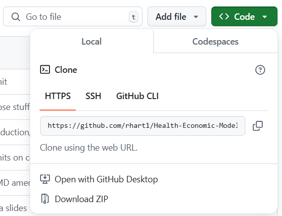
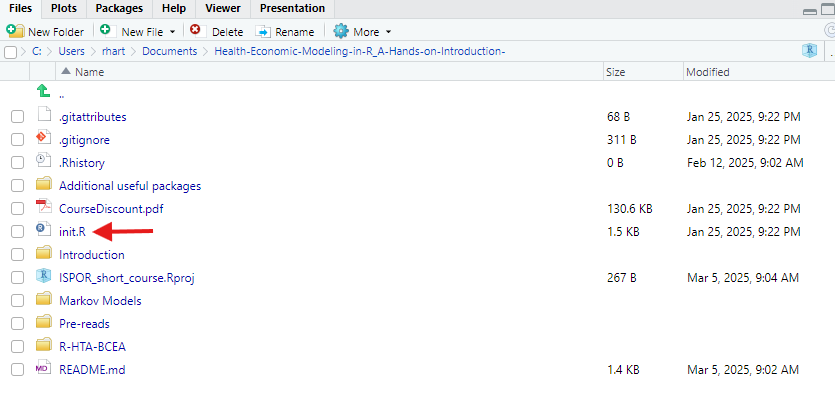

```{r setup, echo=FALSE}
knitr::opts_chunk$set(
  cache = FALSE,
  message = FALSE,
  warning = FALSE,
  fig.height = (12 / 2.5),
  fig.width = (18 / 2.5),
  dpi = 350,
  pdf(encoding = "ISOLatin9.enc")
)
```
\newpage
\definecolor{colourblue}{RGB}{0, 0, 255}

# Introduction

This document outlines course structure and pre-read materials for the ISPOR 2021 virtual short course entitled "Health Economic Modeling in R: A Hands-on Introduction".

The planned itinerary for the course is presented below. All times are in **Eastern Daylight Time**. Please see the [\textcolor{colourblue}{ISPOR short course website}](https://www.ispor.org/conferences-education/education-training/short-courses) for time zone conversions.
\newline

  8:00 – 8:05 Welcome and Introductions \newline 
  8:05 – 8:20 Why use R? \newline 
  8:20 – 9:00 Decision Trees in R \newline
  9:00 – 10:00 R package BCEA \newline 
  10:00 – 10:30 BREAK \newline 
  10:30 – 11:30 Discrete-time cohort Markov models in R \newline 
  11:30 – 12:30 Advanced functionality of R \newline


All parts of the course will have practical demonstrations and exercises for attendees to view in-session and will be available post-session via our combined [\textcolor{colourblue}{GitHub repository}](https://github.com/rhart1/Health-Economic-Modeling-in-R_A-Hands-on-Introduction-)</u>.

It is recommended that you read through this document prior to attending the short course, and action the necessary points. There are further recommended materials provided; these will be discussed in the course, but can be completed after the session by attendees. 


# Pre-course requirements

## Download R {#DownloadR}

This [\textcolor{colourblue}{introduction to R online book}](https://alexd106.github.io/intro2R/index.html) is a great place to start with learning R and is not specific to Health Economics. Please view the [\textcolor{colourblue}{setup}](https://alexd106.github.io/intro2R/setup.html) page to go through installing R and R Studio on your machines. Please install R version 4.0.5 or higher. Also, please look at the 'Introducing RStudio' video to familiarize yourself with the RStudio layout. 

You may find this book useful for continued post-course learning, as it has many great (and free) [\textcolor{colourblue}{tutorials}](https://alexd106.github.io/intro2R/howto.html) and [\textcolor{colourblue}{exercises}](https://alexd106.github.io/intro2R/exercises.html) for beginners.

## Introduction to R coding

It is recommended that attendees are familiar with the syntax and basic methods of R coding, such as how to assign variables and knowing the basic data types. Therefore, all attendees who are using R for the first time should undertake a practical introduction to R via DataCamp [\textcolor{colourblue}{'Intro to basics'}](https://www.datacamp.com/courses/free-introduction-to-r) module for hands-on exercises prior to the short course.

## Access the course materials

### Downloading materials
The course materials can be found in our [\textcolor{colourblue}{GitHub repository}](https://github.com/rhart1/Health-Economic-Modeling-in-R_A-Hands-on-Introduction-) (at <https://github.com/rhart1/Health-Economic-Modeling-in-R_A-Hands-on-Introduction->). It is recommended that materials are accessed between 14th-16th June 2021 as they will be the most up-to-date before the session whilst giving you time to prepare and install packages ahead of the session.

If attendees have a GitHub account and are happy with forking a project to their own accounts then feel free to do so. For those without a GitHub account, all project materials can be downloaded via a ZIP folder as indicated in the image below. GitHub is recommended but optional; it is useful for code version control and managing projects in any coding language. Further details can be found in ['Other pre-course materials'](#optionalmaterial)



### Opening materials
Once attendees have the materials folder via ZIP or GitHub, the project needs to be opened in RStudio as a **project**. For those who are unfamiliar with project files, they are self-contained work areas that can be managed by version control software (Git). When a user opens a project, the working directory (file location) is set automatically to the location of the project, meaning that scripts that reference other scripts (in shiny apps or markdown documents this is common, and will be covered in the 'Advanced functionality of R' part of the course).

To open the materials as a project, within RStudio, please go to 'File' -> 'Open project in New Session', then find the location where you have the materials file saved. You need to click on the '.proj' file. 


### Downloading required packages
Once you have opened the project, if this is the first time opening then you will need to run the init.R script. 



The init.R script has a code which checks the packages that are already installed. It will download and install all the packages that are required for the short course that are missing, and will then load all packages. If you have not previously used R, then this may take a few minutes. If you have used R before and have many of the packages installed, then please update your existing packages by going to 'Tools' -> 'Check for package updates' in RStudio to update to the most recent version. 

Once those are downloaded then you are ready for the short course

### On the day
Some of the short course sessions will be running through code live, so on the day it would be best if all attendees have the R project with the short course materials open, even if not all of the packages have been successfully installed.


# Other pre-course materials (optional) {#optionalmaterial}
This section is additional reading to complement some of the above instructions. It is recommended as prior reading, but is optional. Alternatively, it can be completed after the course to flesh out some of the practical details for using R for health economic projects.

## What is a package and how to install them
This [\textcolor{colourblue}{DataCamp guide}](https://www.datacamp.com/community/tutorials/r-packages-guide) gives a useful overview of what packages are, how they can be used, how to install them, and an explanation into some of the language used when talking about R.


## Background and instructions for Github
As mentioned previously, Git is software that manages version control for code, and GitHub is the interface to view and manage the changes over time. This [\textcolor{colourblue}{online github guide}](https://guides.github.com/activities/hello-world/) is useful for detailing how to use Git and takes the reader through creating a repository, branching, and making changes. 

Additionally, the [\textcolor{colourblue}{setup}](https://alexd106.github.io/intro2R/setup.html) guide referenced in the [Download R]{#DownloadR} section above also mentions GitHub and R Markdown in the 'Optional Software' section for some background and useful reading.

